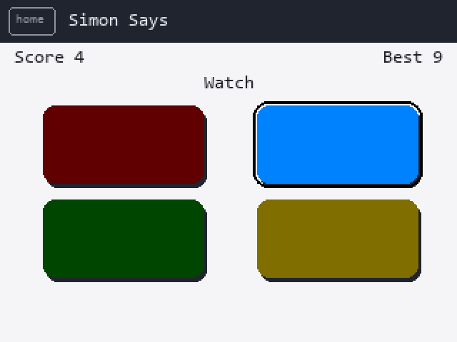
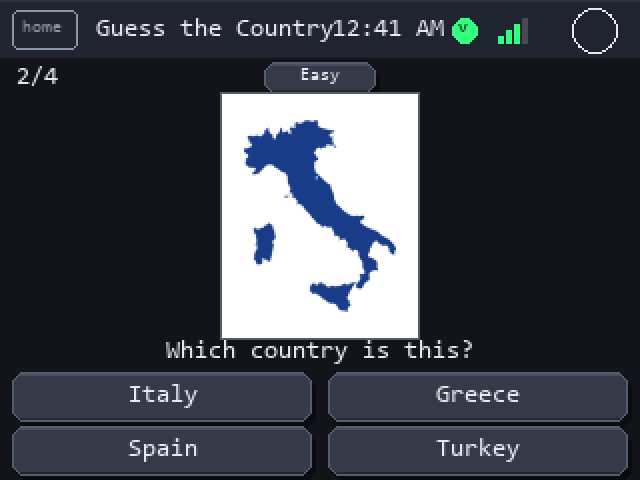
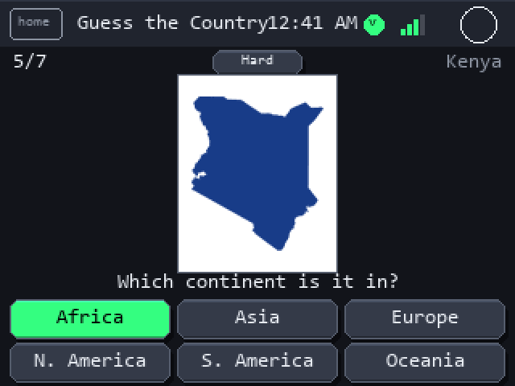
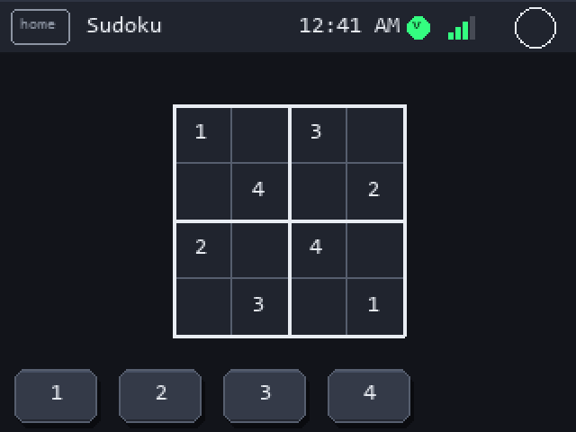
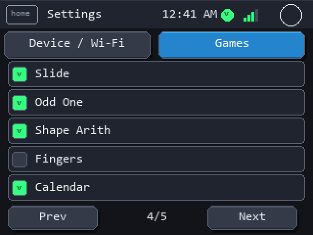

# GoodTime Kids

A 23-game educational console for young children, running on an **ESP32-32E
board** (E32R28T-1 — ILI9341 320×240 resistive
touchscreen, 4 MB flash, no PSRAM).

Everything is baked into the firmware: **no SD card, no internet, no accounts,
no data collection.** Wi-Fi is used for exactly one thing — fetching the time
from an NTP server.

| | |
|---|---|
| Games | 23 |
| Flash | 2,304,761 / 3,145,728 bytes (**73.3%**) |
| RAM | 50,312 / 327,680 bytes (**15.4%**) |
| Country artwork | 195 flags + 191 outlines, 1.11 MiB (49% of the image) |

<p align="center">
  
  
</p>

> **About the images in this README.** These are **rendered mock-ups**, not
> device photos. They are redrawn on a PC by `tools/gen_screens.py` using the
> exact rectangles, fonts and colours from the C++ source, so the layout is
> accurate. The flag and outline artwork *is* the real pixel data, decoded from
> the generated arrays the device draws from. True screenshots aren't possible
> because the target board doesn't wire the panel's MISO line for read-back.

---

## The games

Ages are a guide, not a gate. Every game can be hidden from the launcher in
**Settings → Games**, so you can pare the list down to what one child needs.

### Numbers and early maths

| Game | What it is | What it builds | Age |
|---|---|---|---|
| **Counting** | "How many objects?" — tap the matching number | One-to-one correspondence: the idea that counting means one number per object | 3–5 |
| **Fingers** | Alternates *"How many fingers?"* (count what's raised) and *"Show me 7 fingers"* (raise that many) | Counting on hands in **both** directions — recognising a quantity and producing one | 3–6 |
| **Shape Arith** | Objects appear one by one to add; for subtraction they flash and vanish | Makes arithmetic concrete before it's symbolic. The subtraction blink **loops**, so a child who looks away can re-watch | 4–6 |
| **Number Line** | A marker hops along a number line to reach the answer | Turns addition and subtraction into *movement* — the mental model behind mental arithmetic | 5–7 |
| **Math** | "Tap the answer" — addition and subtraction, difficulty rises with level | Recall speed once the concept is solid | 5–8 |
| **Multiply** | "Tap the product" — times tables | Multiplication facts | 7–10 |
| **Fractions** | "Pick the matching fraction" against a pie chart | Connects the written fraction to the amount it represents | 6–9 |
| **Money** | "How much is this?" — count coins, compare amounts, make change | Coin values and everyday arithmetic | 5–9 |
| **Sorting** | "Tap smallest to largest" (or the reverse) | Ordering and magnitude comparison | 4–7 |

### World knowledge

| Game | What it is | What it builds | Age |
|---|---|---|---|
| **Flags** | A real flag, name the country. Correct answers unlock a **capital-city bonus** | 195 flags with a genuine reward loop; capitals arrive as a bonus rather than a chore | 5–12 |
| **Countries** | A real country outline, alternating *"which country?"* and *"which continent is it in?"* | Map-shape recognition, plus where countries sit in the world | 6–12 |
| **Calendar** | "What comes after Wednesday?" — days and months | Sequence and cyclical time | 4–7 |
| **Time** | "Which time is shown?" on an analogue clock | Reading a clock face | 5–8 |

Flags and Countries both use **spaced repetition** and **adaptive difficulty** —
see below.

### Logic, memory and attention

| Game | What it is | What it builds | Age |
|---|---|---|---|
| **Simon** | Repeat the colour sequence | Working memory and sustained attention | 4–10 |
| **Memory** | Match pairs face-down | Visual working memory | 3–8 |
| **Odd One** | "Tap the one that is different" | Categorisation — spotting the attribute that doesn't fit | 3–6 |
| **Shapes** | Match a named shape *and* colour, e.g. "red circle" | Holding two attributes in mind at once | 3–6 |
| **Color Mix** | "What do you get?" mixing two colours | Colour theory, and that mixing is predictable | 4–8 |
| **Sudoku** | 2×2 up to 6×6 grids | Constraint reasoning, scaled to a child's level | 6–12 |
| **Slide** | Slide numbered tiles into order | Planning several moves ahead | 6–12 |
| **Maze** | Drag a dot to the exit | Fine motor control and route planning | 3–7 |
| **Whack** | Tap the smiles before they vanish | Reaction time and visual scanning | 3–8 |
| **Tic-Tac-Toe** | Two players | Turn-taking and blocking — best played with a grown-up | 4+ |

---

## What makes it more than a quiz

### Spaced repetition

Questions used to be drawn uniformly at random, so a child saw Brazil exactly as
often as Bhutan and got no extra practice on the ones they missed.

Flags and Countries now keep a mastery score per country
(`src/engine/Progress.cpp`). A miss costs **twice** what a correct answer earns,
so a missed country returns quickly and only leaves the rotation after repeated
success. Weighting runs from **8×** for a recently-missed country down to **1×**
for a mastered one — mastered items still appear, just rarely, so the mix stays
varied.

The two games track **separately**: recognising Italy's flag says little about
recognising its outline.

### Adaptive difficulty

Three tiers — **Easy** (30 familiar countries), **Medium** (62), **Hard** (all
195). Six correct in a row promotes a tier automatically. The tier button still
overrides by hand, and the choice persists.

### Accessibility

Simon originally repainted the **whole screen** on every step, producing a
full-screen flash roughly once a second — uncomfortable generally and a genuine
risk for photosensitive players. It now repaints only the pads that changed, so
there is **no full-area luminance change at all**, and mirrors each colour on
the case LED so the cue doesn't depend on the screen flashing.

<p align="center">
  
</p>

---

---

## Every game

One screen per game, in launcher order.

### Numbers and early maths

<p align="center">
  
  
  
  
</p>
<p align="center">
  
  
  
</p>
<p align="center">
  
  
  
</p>

### World knowledge

<p align="center">
  
  
  
</p>
<p align="center">
  
  
  
</p>

### Logic, memory and attention

<p align="center">
  
  
  
</p>
<p align="center">
  
  
  
</p>
<p align="center">
  
  
  
</p>
<p align="center">
  
</p>

---

## System screens

### Settings

<p align="center">
  
  
</p>

Theme, menu layout, screen-saver delay and the case light. The Games tab hides
any game from the launcher, paged five at a time.

**Menu layout is launcher-only.** Every game is authored against the fixed
320×240 landscape canvas, so Tall changes the home screen and nothing else.

### Network & Time

<p align="center">
  
  
</p>

Wi-Fi exists **only** to set the clock. The time zone is detected from the
public IP on first connect; the picker overrides it with named zones carrying
POSIX rules (`CST6CDT,M3.2.0,M11.1.0`), so daylight saving is handled without
anyone touching it in March and November.

### Screen saver

<p align="center">
  
</p>

Pong that plays itself. Paddles sweep opposite ways; every rally speeds the ball
up and advances the colour, mirrored on the case LED. Touching it returns you to
**whatever you were doing** — not the home screen.

---

## Version

Current release: **2.0.1** — see [CHANGELOG.md](CHANGELOG.md) for what changed.

---

## Build and flash

```bash
pio run -e app -t upload
```

Requires **PlatformIO**. The `huge_app.csv` partition (3 MB) is already set in
`platformio.ini` — the default 4 MB scheme gives the app only 1.31 MB, which is
less than the country artwork alone.

Dependencies resolve automatically:

| Library | Purpose |
|---|---|
| `bodmer/TFT_eSPI` | Display and touch |
| `bblanchon/ArduinoJson` | Optional SD content configs |
| [`map-n-flag`](https://github.com/iamankushpandit/map-n-flag) | Flag and outline artwork |

### Diagnostics

An isolated Wi-Fi radio test, built with **no** display, touch or game code:

```bash
pio run -e wifidiag -t upload
```

It scans and prints every network with RSSI, channel and encryption. This is
what proved the radio was fine when the app's scan was returning nothing — the
async `scanNetworks()`/`scanComplete()` pair was silently failing on this board,
while a blocking scan found 58 access points.

The main firmware also traces the clock over serial at 115200:

```
[boot] ntp=1 creds=1 ssid='MyNetwork' tzmin=-360
[time] wifi up, ip=192.168.1.142 rssi=-57
[time] configTzTime US Central (CST6CDT,M3.2.0,M11.1.0)
[time] UDP NTP OK, clock set from pool.ntp.org
[time] SYNCED 2026-08-11 01:00:16 (US Central)
```

---

## Layout of the code

```
src/
  main.cpp              launcher, screen saver, game dispatch
  engine/
    Game.h              base class; full vs partial redraw invalidation
    GameCatalog.cpp     the single source of truth for the game list
    Progress.cpp        per-item mastery, spaced repetition
    ContentLoader.cpp   optional SD-card config (everything has defaults)
  games/                one .cpp/.h pair per game
    CountryData.cpp     capitals, continents, difficulty tiers
    CountryDataTable.cpp  generated -- see tools/gen_country_facts.py
  hal/
    Board.cpp           display, touch, NVS, Wi-Fi/NTP, audio, RGB LED
    Clock.cpp           time and date formatting
  ui/Ui.cpp             theming, widgets, map-n-flag blitting
tools/
  gen_country_facts.py  regenerates the capital/continent table
  gen_screens.py        regenerates the images in this README
```

`GameCatalog` matters more than it looks: the game ids, launcher titles and
Settings labels used to live in **two arrays coupled by index**, with nothing
enforcing agreement. A silent mismatch would hide the wrong game.

---

## Credits and licensing

Code in this repository is MIT.

| Asset | Source | Licence |
|---|---|---|
| Flags | [lipis/flag-icons](https://github.com/lipis/flag-icons) | MIT |
| Country outlines | [djaiss/mapsicon](https://github.com/djaiss/mapsicon) | ⚠️ **Custom — no resale** |
| Capitals / regions | [mledoze/countries](https://github.com/mledoze/countries) | ODbL |

> ⚠️ **The outline artwork is not licensed for resale.** mapsicon's terms are
> *"Do what you want with them as long as you mention me in your project. Please
> don't resell them - I forbid it!"* Fine for personal and educational use **with
> credit to David Jaiss**. Anyone wanting to sell or otherwise monetise this must
> first swap the outlines for [Natural Earth](https://www.naturalearthdata.com/)
> (public domain), which touches only the asset pipeline.
>
> Note also that the Arduino-ESP32 core is **LGPL** — distributing a
> statically-linked binary carries relinking obligations.
