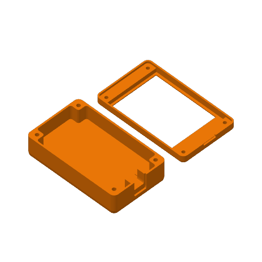

# Case — E32R28T-1 (ESP32-32E, 2.8-inch)

The enclosure for the board Braino targets today: the E32R28T-1 / ESP32-32E
with the ILI9341 320×240 resistive touch panel. Board details, including the
pinout this case has to leave reachable, are in
[BOARD_E32R28T-1.md](../../BOARD_E32R28T-1.md).

  

## What is here

| File | What it is |
|---|---|
| `BrainoCase.stl` | Both parts, arranged on one plate. Open this in any slicer. |
| `BrainoCase.3mf` | Bambu Studio project — the same two parts with the print profile below already applied. |
| `preview.png` | Slicer render of the plate. |

Two parts, printed flat, no supports:

| Part | Size | Role |
|---|---|---|
| Back plate v2 | 53.4 × 89.4 × 7.0 mm | Tray the board drops into, with corner bosses and a side cut-out for the USB connector |
| Top plate v3 | 53.4 × 89.4 × 6.7 mm | Bezel that frames the display and clamps the board down |

Together they occupy roughly 125 × 91 × 19 mm on the build plate, so they fit
any bed from a 180 mm printer upwards on a single plate.

## Print settings

These are the settings the `.3mf` carries — the profile the parts were sliced
with, not a guess:

| | |
|---|---|
| Printer | Bambu Lab X1 Carbon, 0.4 mm nozzle |
| Profile | 0.16 mm High Quality @BBL X1C |
| Layer height | 0.16 mm (0.2 mm first layer) |
| Material | PLA |
| Walls | 2 |
| Infill | 15% |
| Supports | **None** — both parts print flat |
| Brim | Auto |
| Plate | Textured PEI |

Nothing here is X1C-specific. Any 0.4 mm FDM printer running a 0.15–0.2 mm
profile in PLA or PETG will produce usable parts; open the STL rather than the
3MF and use your own profile.

## Assembly

The board sits in the back tray, display upwards, with the USB connector
through the side cut-out. The bezel goes on top and the two plates screw
together through the four corner holes.

**Fasteners used, and why they are not a recommendation:**

| Part | Detail | Cost |
|---|---|---|
| Screw | M3-0.50 × 25 mm socket head, 2 mm hex key (ACE Hardware, part `43908-G`) | ~$1.19 each |
| Washer | M3 flat washer (ACE Hardware, part `H923010-543053`) | ~$0.15 each |

Four of each, bought off the shelf at ACE Hardware. They work — the assembled
shell holds the board and the battery pack firmly — but read the table as
"these are what the current holes happen to take", not as a shopping list:

- **They stick out.** 25 mm is longer than the stack needs, so the screws
  protrude past the back. A shorter M3 is almost certainly the right length;
  nobody has measured what it is.
- **They are expensive.** About **$5.36 of hardware per unit**, a noticeable
  fraction of what the board costs, for a fit no better than cheap
  self-tapping screws would give.

The fix is a redesigned case with fastening chosen as part of the model rather
than found afterwards, which is
[issue #13](https://github.com/iamankushpandit/Gume/issues/13).

There is no dedicated battery compartment. The single-cell Li-ion/LiPo pack the
board charges (see the Battery section of the [README](../../README.md)) has to
be placed in the free space in the tray by hand.

## Status — this is the stopgap, not the design

Printed and assembled with the fasteners above. It works: the board and the
battery are held nicely and the thing is usable. It is still a first shell —
screws that protrude and cost more than they should, no light pipe for the RGB
LED, and no speaker volume set aside.

**A proper enclosure is [issue #13](https://github.com/iamankushpandit/Gume/issues/13)**,
which lists the constraints the firmware imposes on the mechanical design —
the LED is the only non-visual feedback channel and must be visible, the
resistive panel needs backing from behind, USB and BOOT must stay reachable
without opening the case, and the battery must need a tool. Read it before
starting a redesign; several of those are not obvious from looking at the
board, and all of them are expensive to discover at first fit.

**It is queued behind [issue #8](https://github.com/iamankushpandit/Gume/issues/8)**
(the battery gauge). Runtime cannot be measured while the gauge bounces and 0%
does not mean empty, and pack size drives the internal volume — so the case is
sized around a battery decision that cannot be made yet.

Until then: if you print this one, say what happened —
[open an issue](https://github.com/iamankushpandit/Gume/issues) or a pull
request against this file.
