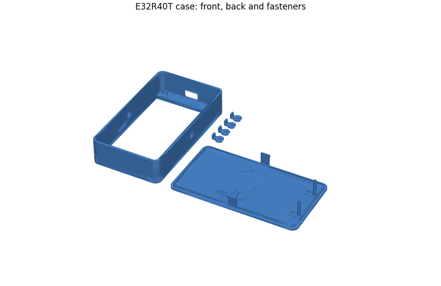

# Case — E32R40T (4-inch)

An enclosure for the E32R40T, the 4-inch ST7796 board: a front shell that frames
the display, a back plate, and four printed fasteners, all on one plate.

  

## What is here

| File | What it is | Size |
|---|---|---|
| `BrainoCase.stl` | All the parts, arranged on one plate: front shell, back plate and four fasteners | 195.5 × 119.5 × 24.0 mm |
| `preview.png` | Render of the plate, generated from the STL | |

The plate needs a bed of at least about 200 × 120 mm; split the parts in your
slicer to print them on a smaller one.

## Print settings

Not recorded yet. If you print it, add the layer height, material, supports and
anything you had to change here -- see [the cases README](../README.md) for
what is most useful.

## Assembly

Not written up yet: how the board, the back plate and the four printed
fasteners go together, how the battery is held, and whether any screws are
needed.

## Status

**Printed and fitted** by the maintainer with an E32R40T inside.
