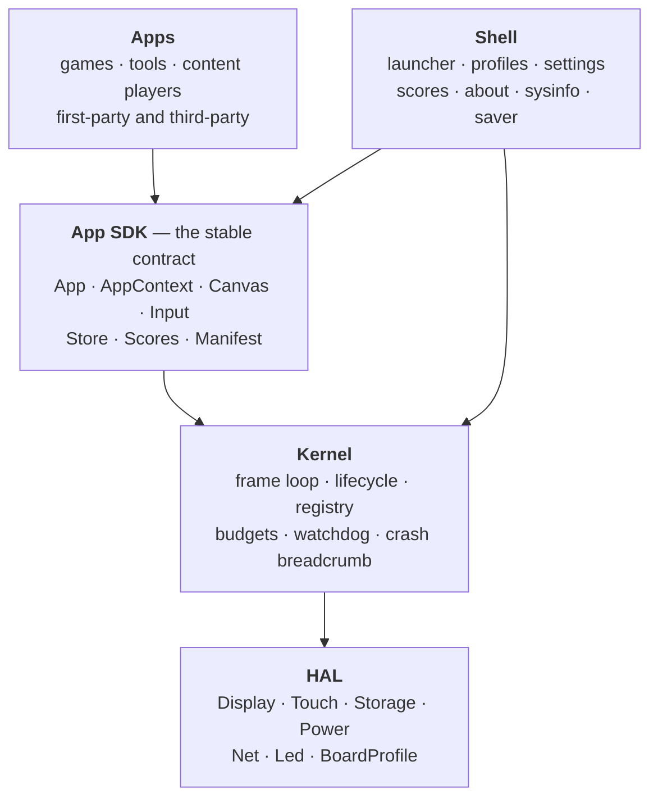

# From firmware to framework — a decoupling plan

**Status: proposal. Nothing here is implemented.** This document is the design
argument and the sequencing plan; it deliberately stops short of code.

The thesis is short. GUme is currently *one program that contains 30 games*. It
should be *a framework, plus a product assembled from it*. The framework is what
other people contribute to; GUme becomes its first and reference distribution —
and the proof that the framework is good enough to build a real product on.

---

## 1. The case, in the codebase's own numbers

This is not a speculative refactor. The coupling is measurable, and the failure
modes it produces are already documented in `CLAUDE.md` as things that have gone
wrong.

| Symptom | Evidence today |
|---|---|
| Adding one game touches five files across three subsystems | The checklist in `CLAUDE.md` §"Adding a game" has **14 steps**, only 6 of which are code |
| `main.cpp` knows every app by name | 36 game `#include`s, `EntryKind` with 35 members, a 28-arm `launchKind()` switch, a ~28-arm `drawLauncherIcon()` switch, 28 static member instances — 1,389 lines |
| Three parallel arrays coupled by index, across three files | `GAME_CATALOG[28]`, `CATALOG_KINDS[28]`, `SCORE_CATALOG[27]` — nothing enforces agreement, and a misalignment **compiles, links and launches the wrong game** |
| Apps get the whole machine | `GameHost::board()` returns `Board&`, whose 353-line header exposes `factoryReset()`, `setWifiCredentials()`, `setProfileName()`, `runTouchCalibration()` |
| Every app is resident forever | 28 `static` screen instances; RAM cost is O(sum of all apps), not O(largest app) |
| Restated facts drift; derived facts do not | `check_docs.py` reports **clean** right now while line 143 of `CLAUDE.md` says "26 games" and `GAME_CATALOG_COUNT` says **28**. The check guards the README, not that sentence. Every fact a machine derives has stayed true; every fact a human retyped has not. |

That last row is the whole design philosophy of this project, already stated in
`CLAUDE.md` ("derive rather than restate"), and it is precisely what the
framework generalises: **an app should declare itself once, next to its own
code, and every other part of the system — launcher, Settings, Scores, About,
the README, the website, the screenshots — should read that declaration.**

### What is already right

This does not start from zero. Four things are already framework-shaped and
should be preserved rather than replaced:

- **`Game` / `GameHost`** (`src/engine/Game.h`) is a genuine app contract:
  `begin` / `update` / `render` / `end`, plus two-level invalidation. It is
  small, correct, and has survived 28 implementations. It is the seed.
- **`leaveActiveGame()`** is a single transition funnel with heap accounting
  already wired into it. That is the kernel's app lifecycle, in embryo.
- **Profile scoping is already invisible to apps.** `Board::scopedKey()` is
  private and prefixes every read and write, so all 28 games became per-profile
  without touching a single game file. That is exactly how a capability should
  feel.
- **`ScoreCatalog` is keyed by string id, not index.** It is the one of the three
  catalogs that is *not* a merge hazard, and it shows the way.

---

## 2. What "framework" means here

Four layers, each with one job and a stated dependency direction. Arrows point
the only way dependencies are permitted to run.



**Apps never see the kernel or the HAL.** They see the SDK. That single rule is
what makes everything else — capability scoping, host-side testing, board
portability, alternative delivery mechanisms — possible later without
renegotiating with 28 call sites.

| Layer | Becomes | From |
|---|---|---|
| HAL | `Display`, `Touch`, `Storage`, `Power`, `Net`, `Led`, `BoardProfile` | `Board` (1,484 lines) split by concern |
| Kernel | `Runtime`, `AppRegistry`, `Lifecycle`, `Budget`, `Watchdog` | `KidsPlatformApp` in `main.cpp` |
| SDK | `App`, `AppContext`, `AppManifest`, `Canvas`, `Input`, `Store`, `Scores`, `Progress`, `Rng` | `Game`, `GameHost`, `Ui`, parts of `Board` |
| Shell | the seven system screens, as privileged first-party apps | `SettingsGame`, `ProfileGame`, … |
| Apps | one library per app | `src/games/*` |

### Naming

The framework needs an identity separate from the product, because the whole
point is that someone can build a *different* product with it — a different age
range, a different language, a different board. Working proposal: **`Slate`** for
the framework, **GUme / Braino!** for the distribution built on it.
Alternatives worth a moment: `Tilekit`, `Handset`, `gume-core`. *Open decision —
see §11.*

---

## 3. The app contract

This is the surface third parties compile against, and therefore the surface that
is expensive to change later. It should be small, boring, and version-gated.

### 3.1 The manifest — declared once, beside the code

The three parallel arrays collapse into one structure that lives in the app's own
translation unit:

```cpp
struct AppManifest {
    const char*  id;            // "goodtime.flags" -- persisted NVS key, never rename
    const char*  title;         // launcher tile heading
    const char*  subtitle;      // launcher tile caption
    const char*  blurb;         // About, <=46 chars at font 1
    Category     category;      // Learn | Play | Create | System
    uint8_t      minAge;        // launcher and parental filtering
    uint16_t     sdkAbi;        // major SDK version this was built against
    uint16_t     stateBytes;    // sizeof the app's instance -- see 6.1
    Icon         icon;          // declarative shapes, or a draw callback
    const ScoreDesc* score;     // nullptr when the app records nothing
    App*       (*create)(void* arena);   // placement-new; no heap
};
```

`EntryKind`, `CATALOG_KINDS[]`, `launchKind()`'s switch, `drawLauncherIcon()`'s
switch and the hand-maintained catalog arrays all **disappear**. The hazard
`CLAUDE.md` calls "the one that bites silently" stops existing, because there is
nothing left to keep in agreement.

### 3.2 `AppContext` — capability-scoped, not the whole board

`GameHost` becomes two types:

- **`AppContext`** — what an ordinary app gets. Canvas, input, its own scoped
  `Store`, its own score channel, read-only clock, RNG, feedback as *intents*
  (`ok()` / `error()`, rate-limited by the kernel), and navigation (`goHome()`,
  `requestRender()`). **No network. No settings. No profile management. No other
  app's data.**
- **`SystemContext`** — the additional surface the shell needs: Wi-Fi
  credentials, theme and layout, rotation, profile management, factory reset,
  touch calibration. Obtainable only inside the shell's own translation units,
  and gated by a manifest flag the registry validates.

This is not primarily a defence against hostile apps — on an MCU with no memory
protection you cannot win that fight, and §5 is honest about it. It is about
making an app's blast radius *legible*. Today, reviewing a contributed game means
reading it against ~60 public `Board` methods. Afterwards, the type system states
what it can reach.

### 3.3 `Canvas` — abstraction for source, not for dispatch

Apps must stop including `TFT_eSPI.h`, or the framework can never be built or
tested anywhere but on the device. But this device draws hundreds of primitives
per frame inside a 20 ms budget, so:

> **`Canvas` is a thin, header-inline, non-virtual wrapper over the display
> driver, selected at compile time. It is not a vtable.**

A virtual `Canvas` would add an indirect call to every `drawLine`. Take the
source-level decoupling — which is what enables a host backend and any future
sandbox — without paying for runtime polymorphism the device will never use. When
a second backend arrives (SDL for host builds, §9) it is a build-flag swap, not
dynamic dispatch.

`Ui`'s themed helpers move into the SDK largely unchanged; they are already
stateless and already the right shape.

### 3.4 `Store` — namespaced, quota'd, migratable

`Board::scopedKey()` today produces `p{N}_{key}`. It becomes
`p{N}_{appId}_{key}`, so an app **physically cannot** read or clobber another
app's data, and a third-party id collision cannot silently share a first-party
app's saved scores.

Two consequences to plan for rather than discover:

1. **Migration.** Every shipped device holds `p0_mathBest`, `p0_flagBest` and ~27
   more. A one-shot migration table, run once at boot behind a schema-version
   key, rewrites them into the new namespace. Getting this wrong wipes a child's
   scores, which is the most user-visible failure this project can produce.
2. **Quota.** NVS is finite and shared. Each app gets a byte and key budget
   (proposal: 2 KB / 32 keys by default, raisable in the manifest with review).
   An app that exhausts NVS today takes Wi-Fi credentials and touch calibration
   down with it.

### 3.5 Icons must become data

`drawLauncherIcon()` is ~28 arms of hand-drawn TFT primitives *inside the shell*.
A third party cannot add a tile without editing `main.cpp` — which is the
definition of a framework that isn't one. Two mechanisms, both carried in the
manifest:

- A **byte-coded shape list** (circle / rect / line / poly / glyph, palette
  indices; roughly 12–40 bytes each) interpreted by the shell. Portable to every
  delivery tier including data-only and scripted apps, and almost certainly
  *smaller* in flash than 28 inline switch arms.
- A **draw callback** as the escape hatch for first-party art that needs it.

---

## 4. Registration and discovery

### 4.1 Self-registration: no heap, no fixed array

Each app's TU declares a `static AppRegistration reg{&MANIFEST};` whose
constructor links the manifest onto an intrusive list. Three properties matter:

- **No allocation** — the node is a member of the app's own static manifest
  object. Consistent with the memory rule; nothing is ever freed.
- **No central array to overflow**, and no count constant to keep in sync.
- **Order-independent** — but see the traps below.

**Two known traps, both to be designed for up front:**

1. **Static initialisation order is unspecified across translation units.** The
   list head must be a POD in `.bss`, zero-initialised before any dynamic
   initialiser runs (guaranteed by the standard). A registration constructor may
   touch *nothing else* — no `String`, no `Preferences`, no logging.
2. **The linker discards unreferenced objects in a static library.** An app
   library whose only "use" is a static constructor will be silently dropped and
   the app will simply not exist. Fix: `-Wl,--whole-archive` for app archives, or
   a generated `apps_manifest.cpp` holding one explicit reference per app. This
   is the single most likely way the first attempt fails, and it fails *quietly*.

### 4.2 Launcher order must not depend on link order

Today the launcher order is the array order — a deliberate editorial choice. Link
order is not stable across builds once a library is added, so the registry sorts
on an explicit key: `(category, order, id)`. `order` is an integer in the
manifest; first-party apps carry curated values, contributed apps default to a
high value and sort alphabetically among themselves.

### 4.3 What "discovered by the board" means

Even with everything compiled in, discovery is a *runtime* act: the kernel walks
the registry at boot and everything downstream is built from it. Settings
visibility, Scores, About, the launcher and its paging all become registry
consumers. The 14-step checklist collapses to: **create a directory, write a
manifest, `pio run`.**

---

## 5. Delivery tiers — how an app reaches the board

The same `App` contract can be delivered four ways. The kernel holds a
`const AppManifest*` and does not know which tier produced it. **That is the
decoupling that makes these sequenceable rather than a fork in the road.**

| Tier | Mechanism | Contributor writes | Cost | Verdict |
|---|---|---|---|---|
| **A** | Build-time PlatformIO libraries (`lib_deps`) | C++ against the SDK | app flash only | **Build first.** Zero runtime risk; delivers most of the value |
| **B** | Data-driven content apps — generic engines reading declarative content | JSON/CBOR, no toolchain | one engine, amortised | **Build second. Highest leverage.** |
| **C** | Scripted apps on a bytecode VM (Berry / wasm3 / bespoke) | a script, loaded at runtime | ~40–80 KB interpreter + arena | **Defer.** Separate decision, §11 |
| **D** | Native runtime loading (relocating ELF loader + `spi_flash_mmap`) | C++ | loader flash + no safety | **Reject.** |

### Why Tier D is rejected

It is technically possible on ESP32, and people have done it. It should not be
done *here*:

- **No memory protection.** A stray pointer in a contributed app corrupts the
  kernel. The observable symptom is a child's device rebooting mid-game, with a
  crash breadcrumb naming a screen that is not at fault.
- The Xtensa windowed ABI and the absence of first-class PIC support in this
  toolchain make the relocation path fragile and toolchain-version-sensitive.
- Executing from mmap'd flash means cache-miss stalls inside a 20 ms frame
  budget.
- It buys, at considerable cost, the one thing the web installer already
  provides.

If it is ever revisited, the precondition is different silicon (ESP32-S3/P4,
PSRAM, memory protection) — not more effort on this one.

### Why Tier B is the real ecosystem

Of the 28 games, a large group — Flags, US States, State Flags, State Maps, GRE
Words, Odd One Out, Calendar, Counting — are **the same archetype**: present a
prompt, offer choices, score, track mastery via `Progress`, repeat. Perhaps five
archetypes cover most of the catalog:

`Quiz` · `TapTarget` · `Sequence` · `Trace` · `GridMatch`

A contributor who wants "Planets", "Spanish colours", "Times tables to 20" or
"Diwali facts" should write a content file, not a C++ class. That is a
hundred-fold larger contributor pool, it carries **zero code-safety risk**, and
`ContentLoader` plus `docs/SD_CONTENT_SPEC.md` are already the germ of it.

### The web installer is already the app store

`https://iamankushpandit.github.io/Gume/` flashes a board over Web Serial, and CI
rebuilds it on every push to `main`. That is distribution infrastructure that
already exists. Three ways to turn it into *selection*, in increasing cost:

1. **Ship everything; "install" means enable.** Per-profile visibility already
   exists (`Board::gameVisible`). Nearly free, and correct until flash binds.
2. **Pre-built packs** — core + "Maths pack", "Geography pack", "GRE pack" — as a
   build matrix in the existing workflow. Correct once flash binds.
3. **On-demand builds** via `workflow_dispatch`, ~3–5 minutes, needing rate
   limiting and some abuse thinking. Only if there is real demand.

Current headroom: **891,571 bytes** (2,254,157 of 3,145,728 used, 71.7%). Room
for a meaningful number of small apps before option 1 stops working — but not
unlimited, and *shared*, which is why §9 makes it a CI gate.

---

## 6. The resource model — what makes an ecosystem survivable

This is the section that matters most and is easiest to skip. A plugin
architecture on a device with 3 MB of flash, no garbage collector and a 20 ms
frame budget lives or dies on resource discipline, not on interface design.

### 6.1 Static RAM: apps must stop being permanently resident

Every screen is a `static` instance, so **28 apps cost 28 apps' worth of RAM
whether or not anyone plays them**. `FlagGame` and `StatesGame` each hold a
`Progress` with `int8_t scores_[256]`. That is fine at 28 apps; it is the wall at
100.

The fix is not the heap — the memory rule is right and must survive this. It is a
**single static arena**:

```cpp
alignas(max_align_t) static uint8_t appArena_[SLATE_APP_ARENA_BYTES];
```

The active app is placement-new'd into the arena on launch and destroyed in the
existing lifecycle funnel. No `malloc`, no fragmentation, no free list. RAM cost
becomes **O(largest app)** instead of **O(sum of apps)**. The manifest's
`stateBytes` lets the registry validate at registration, and a build-time
`static_assert` catches an oversized app at compile time rather than on a child's
device.

One consequence to accept deliberately: **an app's state no longer survives
leaving its screen.** Today it does, accidentally. Anything that must persist
goes through `Store`, which is where it belonged anyway.

### 6.2 Frame budget: cooperative scheduling needs enforcement

There is one loop and no preemption, so a badly written app *is* a hang. The
watchdog already reboots at `TIMEOUT_SECONDS = 12` and logs past `STALL_WARN_MS`,
and `CLAUDE.md` already calls a worst frame above ~40 ms a bug. Promote all of
that from convention to kernel policy:

- The kernel times `update()` + `render()` **per app** and attributes overruns by
  app id, in the crash breadcrumb and in System Info.
- Repeated overrun marks the app **degraded** — surfaced in Settings, not
  silently tolerated.
- The existing heap check in `leaveActiveGame()` (`left N bytes short`) becomes a
  **policy** rather than a log line: an app that repeatedly fails to hand back
  what it borrowed gets flagged.

### 6.3 The flash budget is global, and shared

Two contributors can each add artwork that fits locally and together overflow the
partition. `CLAUDE.md` already says this. It becomes CI's job (§9), not
vigilance's.

---

## 7. Capabilities, privacy and safety

### 7.1 Apps get no network. By default, and as a rule.

The README and the About radio page claim: NTP only, no accounts, no telemetry.
`CLAUDE.md` treats a drifted privacy claim as *worse than none, because it is
believed*. An ecosystem in which any contributed app can open a socket destroys
that claim silently and irreversibly.

> **Network is a shell privilege, not an app capability.** `AppContext` exposes no
> socket, no HTTP, no DNS, no BLE. If a future app genuinely needs data from the
> network, it arrives through a brokered, declared, user-visible channel — and the
> About radio page and the README privacy section change in the same commit, per
> the existing rule.

### 7.2 App ids are a persisted namespace

`GameCatalogEntry::id` is already an NVS key whose rename resets state on shipped
devices. In an ecosystem, ids also become a **collision surface**: two
contributors both shipping `"quiz"` would share saved data. Therefore:

- Third-party ids are namespaced: `vendor.appname`.
- Ids are allocated in an index file and treated as permanent.
- **Removing an app orphans its NVS data.** There must be a policy — a
  reap-on-uninstall pass, or an explicit "keep, in case it returns". Not deciding
  is how devices slowly fill with unreachable keys.

### 7.3 This is a children's device

An app ecosystem for four-to-ten-year-olds carries obligations a hobbyist plugin
system does not: content review before an app enters the index, an age field the
launcher actually honours, a parental gate for enabling contributed apps, and a
stated, enforceable content policy. Tier B (data-only) is far easier to review
than Tier A — a second reason to prioritise it.

---

## 8. Non-game apps need something games never did

The ask is "other applications, not just games". The honest architectural finding
is that **the current model cannot express most of them**, because `CLAUDE.md`
states the invariant plainly: *nothing here runs off a task or timer*. One
foreground screen; nothing else alive.

Consider what people will actually want to build:

| App | Needs what games do not |
|---|---|
| Timer / stopwatch | keeps counting after you leave the screen |
| Bedtime routine, chore chart | scheduled state changes, a way to *interrupt* |
| Reading log, sticker chart | long-lived structured storage, across sessions |
| Clock / weather face | to own the screensaver slot |
| Drawing pad | large scratch buffers, and export |
| Parent dashboard | cross-profile reads (the API added in `8608c7b`) |

So the framework must add exactly two concepts, narrowly:

1. **`Service` — a background tick.** An app may register a `backgroundTick()`
   that the kernel calls once per frame regardless of what is in front, with a
   hard budget (proposal: ≤1 ms, measured, degraded on overrun) and **no
   drawing**. That is enough for a timer, a countdown, a scheduled reminder.
2. **Notification intents.** A service may request the shell's attention — a
   badge, a chime, a full-screen alert behind a parental threshold — and the
   *shell* decides how and whether to present it. Apps never seize the screen.

Both are deliberate, narrow extensions to an invariant that is currently
absolute. Either they get added consciously, with budgets, or the invariant gets
restated as permanent and non-game apps stay foreground-only. *This is a real
decision and it belongs to the project owner — §11.*

Worth adding cheaply once the shell is registry-driven: **screensaver and "home
face" as pluggable slots**, so the self-playing Pong becomes one contributed
screensaver among several rather than a hard-coded branch.

---

## 9. Tooling — one machine-readable truth, consumed by device and docs alike

Today `check_docs.py` parses `GameCatalog.cpp` with a regex, `gen_site.py` parses
`AppVersion.h` and the README, and `gen_screens.py` re-implements each screen's
geometry by hand. Three parsers, three chances to drift, and only the parts a
regex can see are guarded.

The framework replaces all of it with **one generated artifact**:

- A **`native` PlatformIO environment** with a stub HAL links the SDK, the shell
  and every registered app on the host, and emits `build/registry.json` — every
  manifest, verbatim, exactly as the device sees it.
- `check_docs.py`, `gen_site.py`, the README game table and the About screen all
  consume that one file. Drift stops being possible rather than being caught.
- **`gen_screens.py` stops approximating.** With a host backend (SDL or a
  headless framebuffer), the mock-ups become *real renders of real app code* —
  which is also the answer to `CLAUDE.md`'s complaint that the Settings picture
  showed a grid that no longer existed.
- **Host-side unit tests become possible for the first time.** An app's logic —
  question selection, scoring, `Progress` weighting — can be tested without
  hardware. That is the single biggest contributor-experience win in this
  document: *you can write a GUme app without owning a GUme.*

CI gains three gates:

1. **Per-app isolation build** — each app library compiled against the SDK alone,
   catching accidental dependencies on shell internals before they become
   everyone's problem.
2. **Flash budget report** — per-app flash delta from the `.map`, posted on the
   PR, failing past a threshold. Flash is global and at 71.7%; this is the only
   scalable defence.
3. **ABI check** — an app declaring an `sdkAbi` the kernel does not support is
   refused at build time, with a clear message.

---

## 10. Migration — strangler fig, never a rewrite

The device ships. Every phase must end with a firmware that builds, flashes and
plays. **No phase is allowed to be a big-bang cutover**, and each has an explicit
exit criterion and a measurement. `pio run` figures go in `README.md` and
`CLAUDE.md` at every phase, per the existing rule.

| Phase | Work | Exit criterion | Risk |
|---|---|---|---|
| **0. Stop the bleeding** | A build-time cross-check that `GAME_CATALOG`, `CATALOG_KINDS` and `SCORE_CATALOG` agree. Fix the "26 games" line. | The index hazard cannot ship again | None. Do this regardless of the rest. |
| **1. Carve the SDK** | Move `Game`/`GameHost`/`Ui`/`Progress` behind SDK headers. No behaviour change, no renames yet. | `pio run` figures unchanged ±0.5% | Low |
| **2. Registry + manifest** | Manifests move beside each app; delete `EntryKind`, `CATALOG_KINDS`, both giant switches; icons become data. | Launcher, Settings, Scores, About all registry-driven; `main.cpp` under 400 lines | **Highest.** The linker trap (§4.1) lands here. Expect flash to *fall*. |
| **3. Split `Board`** | HAL by concern; `AppContext` / `SystemContext`; `Canvas`. Apps stop including `TFT_eSPI.h`. | No app names `Board`; worst frame unchanged | Medium — measure the frame budget before and after |
| **4. Arena instantiation** | Placement-new into a single static arena; `stateBytes` validated. | Static RAM becomes O(largest app) | Medium — app state no longer survives `end()`; audit every app |
| **5. Apps become libraries** | `apps/<id>/` with `library.json`, in-tree first. `Store` namespacing plus the migration table. | An app can be added or removed by touching one directory | **Score migration is user-visible.** Test on a device with real saved scores. |
| **6. Host build + tooling** | `native` env, stub HAL, `registry.json`, real screenshot renders, per-app CI. | An app can be developed and tested with no hardware | Low, high payoff |
| **7. Content tier (B)** | Extract the shared archetypes; declarative content format; content packs. | A new quiz ships with no C++ | Medium |
| **8. First out-of-tree app** | Publish the SDK, write the contributor guide, take one external app end to end. | Someone who is not the author ships an app | The real test of everything above |
| **9. Decision point** | Scripted tier (C), or stop. | — | Deliberately deferred |

Two rules that apply to every phase:

- **Any phase costing more than 2% of flash gets redesigned, not accepted.** There
  are 891 KB of headroom and they belong to apps, not to indirection.
- **Worst-frame is measured before and after each phase** — System Info's Memory
  tab already reports loop load, worst work and worst frame. A framework that
  makes the device feel slower has failed regardless of how clean it is.

### Repository shape

Stay a **monorepo** through phase 8: `framework/`, `apps/`, `product/`, `tools/`.
Splitting repos early is the classic framework mistake — it makes exactly this
phased migration painful, and every phase above crosses layer boundaries. Split
when a third party actually ships an app and needs to depend on a tagged SDK, and
not before.

Note that the existing `CLAUDE.md` worktree protocol maps cleanly onto this: the
spine files it warns about (`main.cpp`, `GameCatalog.*`, `ScoreCatalog.cpp`)
mostly *stop existing* after phase 2, which is the point.

---

## 11. Open decisions — these are the project owner's, not the architecture's

1. **Framework name and identity.** `Slate`, or something else. It affects
   namespaces, header paths and the public repo, so it wants deciding before
   phase 1.
2. **Background services (§8): yes or no?** Without them, "apps" means "screens"
   and a timer app is impossible. With them, the "nothing runs off a task"
   invariant becomes a budget rather than an absolute. This is the largest
   single question in the document.
3. **Scripted tier (C): worth 40–80 KB of flash and a whole subsystem?** Only if
   the answer to "who is contributing?" is people who will not install a
   toolchain — and Tier B may already serve them better.
4. **Store selection model.** Ship-everything-and-enable, pre-built packs, or
   on-demand CI builds (§5). Start with the first; the decision only forces
   itself when flash binds.
5. **Governance.** Who reviews contributed apps, what the content policy is for a
   children's device, how ids are allocated, what licence and CLA contributors
   accept, and what "core" versus "community" means in the launcher.
6. **Board portability.** `BoardConfig.h` describes exactly one unit, down to the
   crossed RGB lines. Supporting a second board (ESP32-S3, a different panel) is
   a `BoardProfile` in the HAL — worth doing at phase 3 if it is ever wanted, and
   much more expensive afterwards.

---

## 12. Non-goals

Stated so they do not get re-litigated mid-refactor:

- **Not** an RTOS, a scheduler, or preemptive multitasking. One loop, one
  foreground app, budgeted background ticks at most.
- **Not** dynamic native code loading (§5, Tier D).
- **Not** a heap-based object model. The memory rule survives the refactor intact:
  no `new`, no `delete`, no `String` in a per-frame path.
- **Not** a general-purpose UI toolkit. `Canvas` and `Ui` stay small and opinionated;
  a retained-mode widget tree would cost more RAM than this device can spare.
- **Not** a networked app platform. §7.1.

---

## 13. What success looks like

- Adding an app touches **one directory**, and `check_docs.py` still passes.
- `main.cpp` does not know the name of a single game.
- A contributor writes an app, tests it on their laptop, and never owns the
  hardware.
- A quiz about the solar system ships as a content file reviewed by someone who
  does not write C++.
- The About screen, the README table, the website and the launcher are four views
  of one registry, and none of them can be wrong.
- Someone builds a product that is not GUme on top of the same framework.
