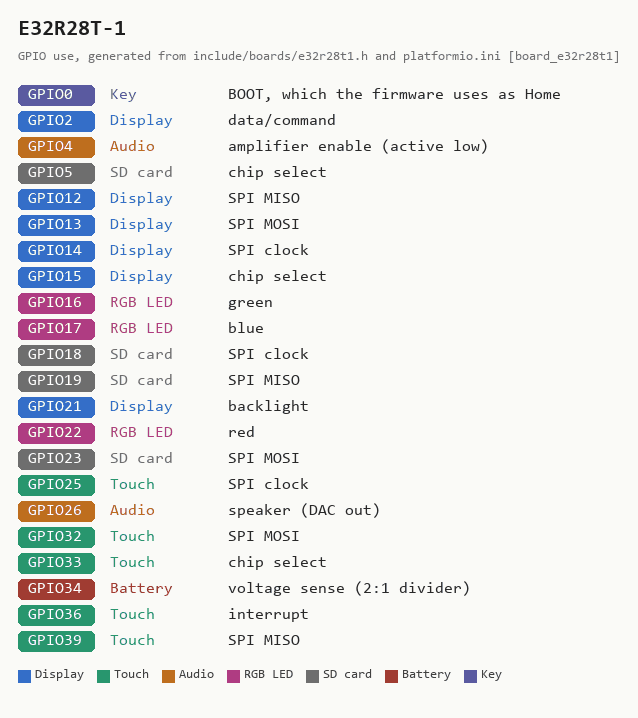

# E32R28T-1 -- 2.8-inch, resistive touch, one USB-C

**How to recognise it:** a 2.8-inch resistive-touch board with **one** USB-C
socket, a 1.25 mm two-pin battery connector, a speaker connector and an RGB
LED. It is the board Braino! is developed against. LCDWIKI sells it as the
**E32R28T** ("2.8inch ESP32-32E Display"); the E32N28T is the same board
without touch and cannot run Braino. It looks like the dual-USB
[ESP32-2432S028](ESP32-2432S028-inv.md) -- count the USB sockets.

**In the installer:** "2.8-inch, resistive touch, one USB-C port -- E32R28T-1 /
ESP32-32E".

## What has been checked on this board

Flashed with 5.10.0 and checked by the maintainer on two boards on 2026-09-11.
This is the reference board: everything on it has been exercised, and the
long-form hardware reference -- pinout, battery sensing, the LED order that the
vendor table once got wrong, the speaker -- is
[BOARD_E32R28T-1.md](../../BOARD_E32R28T-1.md). Sound works on it since 5.10.0:
GPIO25 is both the second DAC pad and the touch clock, and the firmware hands
it back to touch once audio is up.

## Sources

Checked 2026-09-11. The vendor states no licence, so these are linked, not
copied.

| Source | Archived copy | What it gives |
|---|---|---|
| [LCDWIKI: 2.8inch ESP32-32E Display](https://www.lcdwiki.com/2.8inch_ESP32-32E_Display) | [2026-03-24](http://web.archive.org/web/20260324030648/https://www.lcdwiki.com/2.8inch_ESP32-32E_Display) | pin table, photos, resource downloads |
| [Specification (PDF)](https://www.lcdwiki.com/res/E32R28T/E32R28T_E32N28T_Specification_V1.0.pdf) | -- | electrical and mechanical specification |
| [Schematic (PDF)](https://www.lcdwiki.com/res/E32R28T/2.8inch_ESP32-32_Display_Schematic.pdf) | -- | the circuit |
| [Dimensions (PDF)](https://www.lcdwiki.com/res/E32R28T/E32R28T_Size.pdf) | -- | outline and hole positions, for cases |
| [3D model (ZIP)](https://www.lcdwiki.com/res/E32R28T/E32R28T_3D.zip) | -- | for designing an enclosure |
| [ILI9341V datasheet (PDF)](https://www.lcdwiki.com/res/E32R28T/ILI9341V_DataSheet.pdf) | -- | display controller |
| [XPT2046 datasheet (PDF)](https://www.lcdwiki.com/res/PublicFile/XPT2046.pdf) | -- | touch controller |

<!-- BEGIN GENERATED by tools/gen_board_docs.py -- do not edit by hand -->

### From the firmware profile

| | |
|---|---|
| Firmware name (`BOARD_NAME`) | `E32R28T-1` |
| Installer / PlatformIO environment | `app` |
| Device-id tag | `R28T-...` |
| Panel | 240 x 320, ILI9341 driver |
| Touch | resistive XPT2046, its own bit-banged SPI bus |
| Sound | built-in DAC on GPIO26, into an onboard amplifier |
| Battery sense | GPIO34 |
| Flash | 4 MB |

| GPIO | Used for |
|---|---|
| 0 | Key: BOOT, which the firmware uses as Home |
| 2 | Display: data/command |
| 4 | Audio: amplifier enable (active low) |
| 5 | SD card: chip select |
| 12 | Display: SPI MISO |
| 13 | Display: SPI MOSI |
| 14 | Display: SPI clock |
| 15 | Display: chip select |
| 16 | RGB LED: green |
| 17 | RGB LED: blue |
| 18 | SD card: SPI clock |
| 19 | SD card: SPI MISO |
| 21 | Display: backlight |
| 22 | RGB LED: red |
| 23 | SD card: SPI MOSI |
| 25 | Touch: SPI clock |
| 26 | Audio: speaker (DAC out) |
| 32 | Touch: SPI MOSI |
| 33 | Touch: chip select |
| 34 | Battery: voltage sense (2:1 divider) |
| 36 | Touch: interrupt |
| 39 | Touch: SPI MISO |

The printable case, from [cases/E32R28T-1](../../cases/E32R28T-1/):

### Photos

None yet. Add your own as `docs/boards/img/E32R28T-1-front.jpg` (and `-back.jpg`)
and re-run `python tools/gen_board_docs.py`.

<!-- END GENERATED -->
