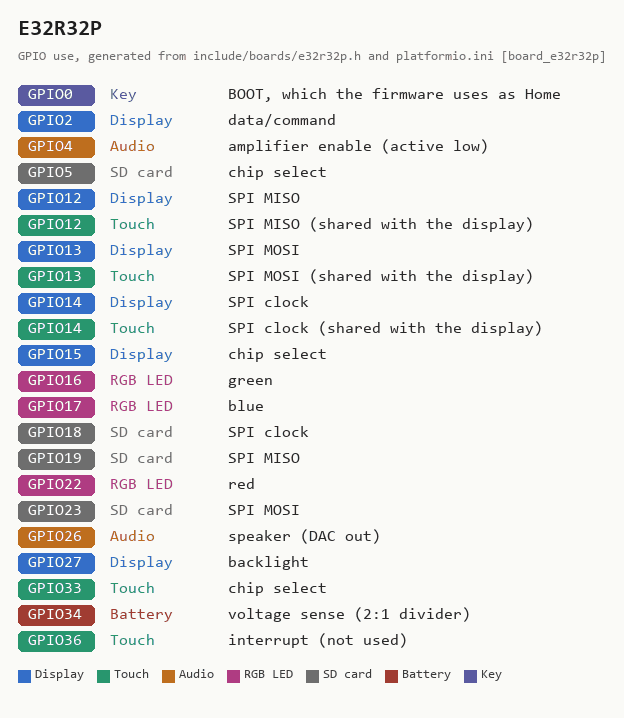
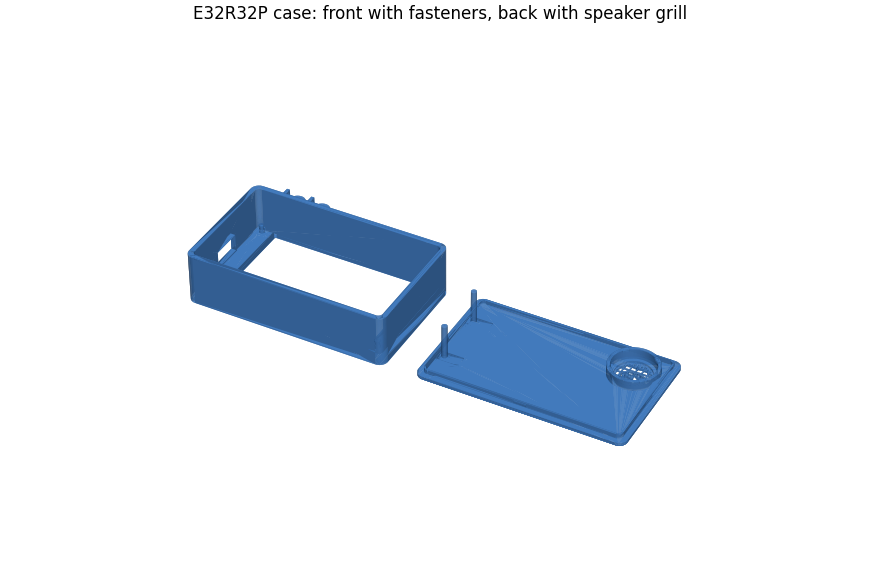

# E32R32P -- 3.2-inch, resistive touch, one USB-C

**How to recognise it:** the 3.2-inch board. One USB-C socket, resistive touch,
a 1.25 mm two-pin battery connector and a speaker connector. LCDWIKI sells it
as the **E32R32P** ("3.2inch ESP32-32E Display"); the E32N32P is the same board
without touch and cannot run Braino.

**In the installer:** "3.2-inch, resistive touch, one USB-C port -- E32R32P".

## What has been checked on this board

Flashed with 5.10.0 and checked by the maintainer on 2026-09-11. Display,
touch, battery sense and the radios were confirmed on hardware during bring-up
with the `diag32p` probe. The panel is an ST7789P3 that is BGR and does *not*
want inversion -- measured, and the reason an ESP32-2432S028Rv3 image looks
nearly right on it with wrong colours and dead touch. Still open: the RGB LED
channel order and the battery divider against a meter. Details in the README's
[E32R32P section](../../README.md#e32r32p-32-inch-st7789p3).

## Sources

Checked 2026-09-11. The vendor states no licence, so these are linked, not
copied.

| Source | Archived copy | What it gives |
|---|---|---|
| [LCDWIKI: 3.2inch ESP32-32E Display](https://www.lcdwiki.com/3.2inch_ESP32-32E_Display) | [2026-08-27](http://web.archive.org/web/20260827160749/https://www.lcdwiki.com/3.2inch_ESP32-32E_Display) | pin table, photos, resource downloads |
| [Specification (PDF)](https://www.lcdwiki.com/res/E32R32P/E32R32P_E32N32P_Specification_V1.0.pdf) | -- | electrical and mechanical specification |
| [Schematic (PDF)](https://www.lcdwiki.com/res/E32R32P/3.2inch_ESP32-32_Display_Schematic.pdf) | -- | the circuit |
| [Dimensions (PDF)](https://www.lcdwiki.com/res/E32R32P/E32R32P_Size.pdf) | -- | outline and hole positions, for cases |
| [3D model (ZIP)](https://www.lcdwiki.com/res/E32R32P/E32R32P_3D.zip) | -- | for designing an enclosure |
| [ST7789P3 datasheet (PDF)](https://www.lcdwiki.com/res/E32R32P/ST7789P3_SPEC_V1.0.pdf) | -- | display controller |
| [XPT2046 datasheet (PDF)](https://www.lcdwiki.com/res/PublicFile/XPT2046.pdf) | -- | touch controller |

<!-- BEGIN GENERATED by tools/gen_board_docs.py -- do not edit by hand -->

### From the firmware profile

| | |
|---|---|
| Firmware name (`BOARD_NAME`) | `E32R32P` |
| Installer / PlatformIO environment | `app_e32r32p` |
| Device-id tag | `R32P-...` |
| Panel | 240 x 320, ST7789 driver |
| Touch | resistive XPT2046, on the display's SPI bus |
| Sound | built-in DAC on GPIO26, into an onboard amplifier |
| Battery sense | GPIO34 |
| Flash | 4 MB |

| GPIO | Used for |
|---|---|
| 0 | Key: BOOT, which the firmware uses as Home |
| 2 | Display: data/command |
| 4 | Audio: amplifier enable (active low) |
| 5 | SD card: chip select |
| 12 | Display: SPI MISO; Touch: SPI MISO (shared with the display) |
| 13 | Display: SPI MOSI; Touch: SPI MOSI (shared with the display) |
| 14 | Display: SPI clock; Touch: SPI clock (shared with the display) |
| 15 | Display: chip select |
| 16 | RGB LED: green |
| 17 | RGB LED: blue |
| 18 | SD card: SPI clock |
| 19 | SD card: SPI MISO |
| 22 | RGB LED: red |
| 23 | SD card: SPI MOSI |
| 26 | Audio: speaker (DAC out) |
| 27 | Display: backlight |
| 33 | Touch: chip select |
| 34 | Battery: voltage sense (2:1 divider) |
| 36 | Touch: interrupt (not used) |

The printable case, from [cases/E32R32P](../../cases/E32R32P/):

### Photos

None yet. Add your own as `docs/boards/img/E32R32P-front.jpg` (and `-back.jpg`)
and re-run `python tools/gen_board_docs.py`.

<!-- END GENERATED -->
