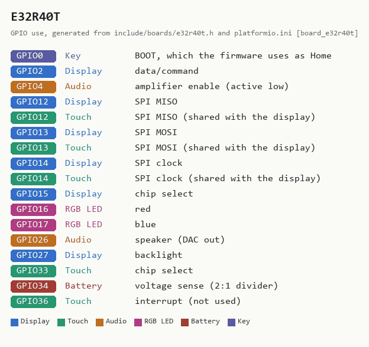

# E32R40T -- 4-inch, resistive touch, one USB-C

**How to recognise it:** the 4-inch board -- the largest supported. One USB-C
socket, resistive touch, and a 1.25 mm two-pin battery connector. LCDWIKI sells
it as the **E32R40T** ("4.0inch ESP32-32E Display"); the E32N40T is the same
board without touch and cannot run Braino, whose only input is the touchscreen.

**In the installer:** "4-inch, resistive touch, one USB-C port -- E32R40T".

## What has been checked on this board

Flashed with 5.10.0 and checked by the maintainer on 2026-09-11. Panel,
backlight (GPIO27) and touch were measured during bring-up with the
`diag4` probe rather than taken from a pin map; the controller is an ST7796
and touch shares the display's SPI bus. The bring-up story, and what is still
switched off on this board, is in the README's
[E32R40T section](../../README.md#e32r40t-4-inch-st7796). The table below is
what the current firmware actually drives.

Known quirk: after an upload's reset this board is sometimes left in a ROM
boot loop (`invalid header` / `flash read err`) with an intact image.
`tools/ESP32_boardUtil.py --flash` notices and recovers it; see CLAUDE.md.

## Sources

Checked 2026-09-11. The vendor states no licence, so these are linked, not
copied.

| Source | Archived copy | What it gives |
|---|---|---|
| [LCDWIKI: 4.0inch ESP32-32E Display](https://www.lcdwiki.com/4.0inch_ESP32-32E_Display) | [2026-08-27](http://web.archive.org/web/20260827160748/https://www.lcdwiki.com/4.0inch_ESP32-32E_Display) | pin table, photos, resource downloads |
| [Specification (PDF)](https://www.lcdwiki.com/res/E32R40T/E32R40T_E32N40T_Specification_V1.0.pdf) | -- | electrical and mechanical specification |
| [Schematic (PDF)](https://www.lcdwiki.com/res/E32R40T/4.0inch_ESP32-32E_E32R40T_E32N40T_Schematic.pdf) | -- | the circuit |
| [Dimensions (PDF)](https://www.lcdwiki.com/res/E32R40T/E32R40T_Size.pdf) | -- | outline and hole positions, for cases |
| [3D model (ZIP)](https://www.lcdwiki.com/res/E32R40T/E32R40T_3D.zip) | -- | for designing an enclosure |
| [ST7796S datasheet (PDF)](https://www.lcdwiki.com/res/E32R40T/ST7796S-Sitronix.pdf) | -- | display controller |
| [XPT2046 datasheet (PDF)](https://www.lcdwiki.com/res/PublicFile/XPT2046.pdf) | -- | touch controller |

<!-- BEGIN GENERATED by tools/gen_board_docs.py -- do not edit by hand -->

### From the firmware profile

| | |
|---|---|
| Firmware name (`BOARD_NAME`) | `E32R40T` |
| Installer / PlatformIO environment | `app_e32r40t` |
| Device-id tag | `R40T-...` |
| Panel | 320 x 480, ST7796 driver |
| Touch | resistive XPT2046, on the display's SPI bus |
| Sound | built-in DAC on GPIO26, into an onboard amplifier |
| Battery sense | GPIO34 |
| Flash | 4 MB |

| GPIO | Used for |
|---|---|
| 0 | Key: BOOT, which the firmware uses as Home |
| 2 | Display: data/command |
| 4 | Audio: amplifier enable (active low) |
| 12 | Display: SPI MISO; Touch: SPI MISO (shared with the display) |
| 13 | Display: SPI MOSI; Touch: SPI MOSI (shared with the display) |
| 14 | Display: SPI clock; Touch: SPI clock (shared with the display) |
| 15 | Display: chip select |
| 16 | RGB LED: red |
| 17 | RGB LED: blue |
| 26 | Audio: speaker (DAC out) |
| 27 | Display: backlight |
| 33 | Touch: chip select |
| 34 | Battery: voltage sense (2:1 divider) |
| 36 | Touch: interrupt (not used) |

The printable case, from [cases/E32R40T](../../cases/E32R40T/):

### Photos

None yet. Add your own as `docs/boards/img/E32R40T-front.jpg` (and `-back.jpg`)
and re-run `python tools/gen_board_docs.py`.

<!-- END GENERATED -->
