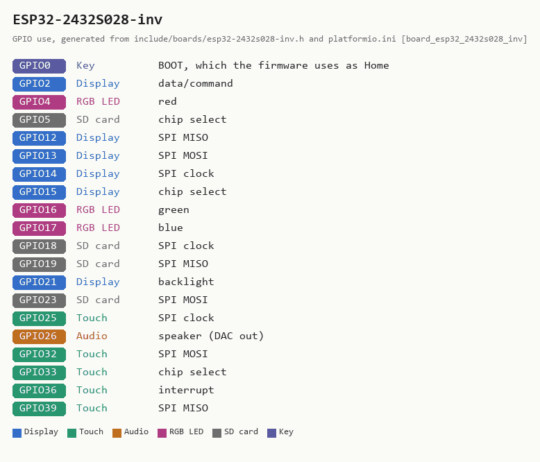

# ESP32-2432S028, inverted panel -- 2.8-inch, resistive touch, USB-C and micro-USB

**How to recognise it:** a 2.8-inch "Cheap Yellow Display" with **two** USB
sockets, one USB-C and one micro-USB. Resistive touch, a speaker connector and
an RGB LED -- and **no battery hardware the firmware can use**. It looks like
the [E32R28T-1](E32R28T-1.md), which has one USB-C socket only.

**In the installer:** "2.8-inch, resistive touch, USB-C plus micro-USB, no
battery (USB power) -- ESP32-2432S028 CYD, inverted panel".

**Run it from USB power:** a wall adapter, a computer, or a USB power bank for
portable use -- for example
[this 5,000 mAh bank](https://www.walmart.com/ip/5K-PWR-BNK/14769668232), a
suggestion that has not been tested with this board. There is no battery badge
and no low-battery warning on this board, because there is nothing to read.

**Many boards share this name.** "ESP32-2432S028" is sold with several
combinations of panel and backlight behind the same silkscreen -- micro-USB
only, ST7789 panels, backlight on GPIO27 -- and they cannot be told apart by
looking. This page is for exactly one: dual-USB, an ILI9341 panel whose
colours come out inverted, backlight on GPIO21. If yours draws a perfect
picture in inverted colours under another image, this is your board.

## What has been checked on this board

Flashed with 5.10.0 and checked by the maintainer on 2026-09-11. Panel, colour
inversion, backlight, touch, rotation and flash size were measured on the
board. **Battery:** with a pack and USB connected, GPIO34 read a steady 0.21 V
where a battery behind a 2:1 divider would read about 2 V -- on a CYD that pin
is the light sensor -- so the firmware declares no battery sense. The RGB LED
follows the published CYD order (red IO4, green IO16, blue IO17). The SD pins
are inherited from the E32R28T-1 and have not been exercised. Details in the
README's
[ESP32-2432S028 section](../../README.md#esp32-2432s028-dual-usb-inverted-panel).

## Sources

Checked 2026-09-11. Neither source states a licence for its pictures, so these
are linked, not copied. No vendor page matching this exact dual-USB board was
found on LCDWIKI.

| Source | Archived copy | What it gives |
|---|---|---|
| [Random Nerd Tutorials: ESP32 Cheap Yellow Display (ESP32-2432S028R)](https://randomnerdtutorials.com/cheap-yellow-display-esp32-2432s028r/) | none found | the CYD family's pins (touch, backlight, RGB LED, light sensor on GPIO34); its comments describe this dual-USB, inverted-colour variant |
| [espboards.dev: CYD ESP32-2432S028](https://www.espboards.dev/esp32/cyd-esp32-2432s028/) | -- | a specification overview of the family |
| [XPT2046 datasheet (PDF)](https://www.lcdwiki.com/res/PublicFile/XPT2046.pdf) | -- | touch controller |

<!-- BEGIN GENERATED by tools/gen_board_docs.py -- do not edit by hand -->

### From the firmware profile

| | |
|---|---|
| Firmware name (`BOARD_NAME`) | `ESP32-2432S028-inv` |
| Installer / PlatformIO environment | `app_esp32_2432s028_inv` |
| Device-id tag | `CYDINV-...` |
| Panel | 240 x 320, ILI9341 driver, colours inverted at runtime |
| Touch | resistive XPT2046, its own bit-banged SPI bus |
| Sound | built-in DAC on GPIO26, into an onboard amplifier |
| Battery sense | **none** -- no battery badge; run it from USB power |
| Flash | 4 MB |

| GPIO | Used for |
|---|---|
| 0 | Key: BOOT, which the firmware uses as Home |
| 2 | Display: data/command |
| 4 | RGB LED: red |
| 5 | SD card: chip select |
| 12 | Display: SPI MISO |
| 13 | Display: SPI MOSI |
| 14 | Display: SPI clock |
| 15 | Display: chip select |
| 16 | RGB LED: green |
| 17 | RGB LED: blue |
| 18 | SD card: SPI clock |
| 19 | SD card: SPI MISO |
| 21 | Display: backlight |
| 23 | SD card: SPI MOSI |
| 25 | Touch: SPI clock |
| 26 | Audio: speaker (DAC out) |
| 32 | Touch: SPI MOSI |
| 33 | Touch: chip select |
| 36 | Touch: interrupt |
| 39 | Touch: SPI MISO |

### Photos

None yet. Add your own as `docs/boards/img/ESP32-2432S028-inv-front.jpg` (and `-back.jpg`)
and re-run `python tools/gen_board_docs.py`.

<!-- END GENERATED -->
