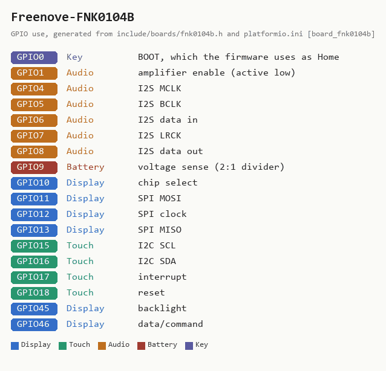

# Freenove FNK0104B / LCDWIKI ES3C28P -- 2.8-inch, capacitive touch, one USB-C

**How to recognise it:** the only **capacitive** touchscreen among the
supported boards, and the only ESP32-**S3**. One USB-C socket on a short edge
(the S3's own USB, so no separate USB-serial chip), a battery connector, an
ES8311 audio codec and one addressable RGB pixel. The same design is sold under
two names: Freenove's **FNK0104B** (the touch version of the FNK0104 kit) and
LCDWIKI's **ES3C28P** ("2.8inch ESP32-S3 Display"). The non-touch versions --
Freenove FNK0104A, LCDWIKI ES3N28P -- cannot run Braino.

**In the installer:** "2.8-inch, capacitive touch, one USB-C port -- Freenove
FNK0104B / LCDWIKI ES3C28P".

**Why one image fits both names:** LCDWIKI's published pins for the ES3C28P
match this profile pin for pin -- display, touch, audio and battery -- and the
profile itself was built from Freenove's own setup files and checked on the
board with the `s3diag` probe.

## What has been checked on this board

Flashed with 5.10.0 and checked by the maintainer on 2026-09-11. Display,
backlight, touch at all four rotations, battery sense and the whole audio path
were confirmed on hardware. Two peripherals are switched off rather than
broken: the status LED (a WS2812 pixel on GPIO42, which the firmware does not
drive) and the SD slot (SDMMC, which the firmware does not speak). Details in
the README's [FNK0104B section](../../README.md#freenove-fnk0104b-esp32-s3).

## Sources

Checked 2026-09-11. Neither vendor states a licence for its pictures or
documents, so these are linked, not copied.

| Source | Archived copy | What it gives |
|---|---|---|
| [Freenove store: FNK0104](https://store.freenove.com/products/fnk0104) | [2026-02-14](http://web.archive.org/web/20260214035237/https://store.freenove.com/products/fnk0104) | the kit, its variants and what is in the box |
| [Freenove tutorial and code](http://freenove.com/fnk0104) | -- | the setup files this profile's pins came from |
| [LCDWIKI: 2.8inch ESP32-S3 Display](https://www.lcdwiki.com/2.8inch_ESP32-S3_Display) | [2026-05-19](http://web.archive.org/web/20260519155748/https://www.lcdwiki.com/2.8inch_ESP32-S3_Display) | pin table, photos, resource downloads |
| [Schematic (PDF)](https://www.lcdwiki.com/res/ES3C28P/2.8inch_ESP32-S3_Display_Schematic.pdf) | -- | the circuit |
| [Dimensions (PDF)](https://www.lcdwiki.com/res/ES3C28P/ES3C28P_Size.pdf) | -- | outline and hole positions, for cases |
| [3D model (ZIP)](https://www.lcdwiki.com/res/ES3C28P/ES3C28P_3D.zip) | -- | for designing an enclosure |
| [FT6336G datasheet (PDF)](https://www.lcdwiki.com/res/PublicFile/D-FT6336G-DataSheet-V1.0.pdf) | -- | touch controller |
| [ES8311 datasheet (PDF)](https://www.lcdwiki.com/res/PublicFile/ES8311_DS.pdf) | -- | audio codec |

<!-- BEGIN GENERATED by tools/gen_board_docs.py -- do not edit by hand -->

### From the firmware profile

| | |
|---|---|
| Firmware name (`BOARD_NAME`) | `Freenove-FNK0104B` |
| Installer / PlatformIO environment | `app_fnk0104b` |
| Device-id tag | `FNK-...` |
| Panel | 240 x 320, ILI9341 driver |
| Touch | capacitive, I2C |
| Sound | ES8311 codec over I2S (I2C address 0x18) |
| Battery sense | GPIO9 |
| Flash | 16 MB |

| GPIO | Used for |
|---|---|
| 0 | Key: BOOT, which the firmware uses as Home |
| 1 | Audio: amplifier enable (active low) |
| 4 | Audio: I2S MCLK |
| 5 | Audio: I2S BCLK |
| 6 | Audio: I2S data in |
| 7 | Audio: I2S LRCK |
| 8 | Audio: I2S data out |
| 9 | Battery: voltage sense (2:1 divider) |
| 10 | Display: chip select |
| 11 | Display: SPI MOSI |
| 12 | Display: SPI clock |
| 13 | Display: SPI MISO |
| 15 | Touch: I2C SCL |
| 16 | Touch: I2C SDA |
| 17 | Touch: interrupt |
| 18 | Touch: reset |
| 45 | Display: backlight |
| 46 | Display: data/command |

### Photos

None yet. Add your own as `docs/boards/img/Freenove-FNK0104B-front.jpg` (and `-back.jpg`)
and re-run `python tools/gen_board_docs.py`.

<!-- END GENERATED -->
